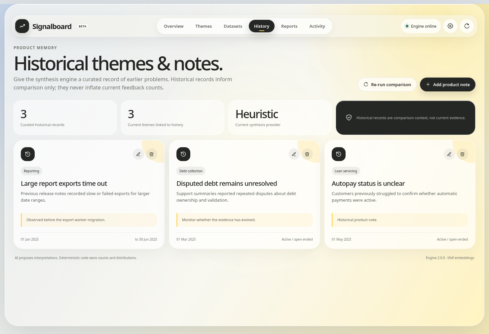
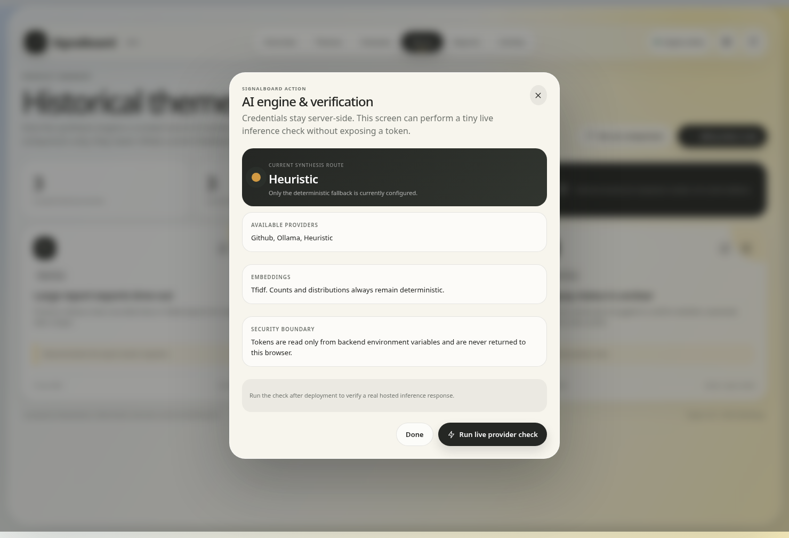
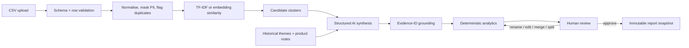
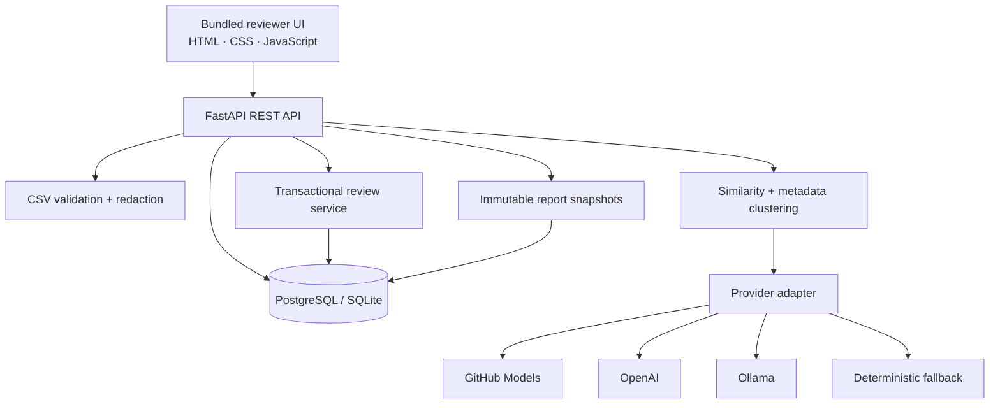

<p align="center">
  
</p>

<p align="center">
  <a href="https://signalboard-feedback-intelligence.onrender.com/"></a>
  <a href="https://github.com/CyberXshaurya/Signalboard-feedback-intelligence/actions"></a>
  
  
  
</p>

<p align="center"><strong>Evidence-grounded AI product-feedback synthesis with deterministic metrics and a complete human-review loop.</strong></p>

<p align="center">
  <a href="#live-product">Product</a> ·
  <a href="#core-workflow">Workflow</a> ·
  <a href="#architecture">Architecture</a> ·
  <a href="#run-locally">Setup</a> ·
  <a href="#verification">Verification</a> ·
  <a href="#deploy-to-render">Deploy</a>
</p>

---

## Live product

**Application:** https://signalboard-feedback-intelligence.onrender.com/  
**Health check:** https://signalboard-feedback-intelligence.onrender.com/api/v1/health

> Render's free web service can sleep after inactivity. The first request after sleep can take roughly a minute while the service wakes.

<p align="center">
  
</p>

### Reviewer experience

| Signal overview | Human review workspace |
|---|---|
|  |  |

| Product memory | Live provider check |
|---|---|
|  |  |

The interface is responsive and keyboard-aware. Modals support visible close/cancel actions, backdrop close, `Escape`, focus restoration and a focus trap. Keyboard shortcuts: `I` opens import and `/` focuses theme search.

## Why Signalboard exists

Feedback often arrives through support, surveys, sales notes and reviews. The difficult part is not producing a summary—it is producing a synthesis that a reviewer can **trace, correct and trust**.

Signalboard separates responsibilities:

- **AI interprets:** candidate themes, summaries, problem statements and historical relationships.
- **Code measures:** counts, distributions, time frequency, duplicate warnings and evidence coverage.
- **Humans decide:** rename, edit, merge, split, approve, reject and publish.

The LLM never owns feedback counts and never prioritises the roadmap.

## Core workflow



### Implemented capabilities

| Area | Capability |
|---|---|
| Ingestion | Required-field validation, aliases, invalid-row isolation, exact-duplicate warnings and upload limits |
| Grounding | Original, normalised and masked text; model evidence IDs intersected with persisted cluster IDs |
| Theme engine | Metadata-aware clustering, oversized-cluster protection, repeated/mixed/isolated handling |
| AI providers | GitHub Models, OpenAI, local Ollama and deterministic credential-free fallback |
| Analytics | Deterministic feedback count, source/user/product-area distribution, rating summary and frequency over time |
| Product memory | Add, edit and delete historical themes/notes; rerun comparison without inflating current counts |
| Review | Evidence drill-down, rename, edit, merge, split, approve, reject and audit history |
| Reports | Versioned immutable snapshots of approved themes, metrics and source evidence |
| Reliability | Structured request/workflow logs, request IDs, typed errors, database startup retry and health checks |
| UX | Loading, validation, empty, success and failure states; keyboard-accessible modal behaviour |

## Architecture



The frontend and backend ship as one Docker service. PostgreSQL stores durable state; static UI assets are served by FastAPI. This keeps deployment simple while preserving clean service boundaries.

More detail: [`docs/ENGINE_ARCHITECTURE.md`](docs/ENGINE_ARCHITECTURE.md) · [`docs/API_WORKFLOW.md`](docs/API_WORKFLOW.md) · [`docs/openapi.json`](docs/openapi.json)

## Repository layout

```text
.
├── src/feedback_intelligence_engine/
│   ├── services/                   # ingestion, clustering, synthesis, review, reports
│   └── web/                        # bundled premium reviewer interface
├── tests/                          # unit, integration, provider-contract and Playwright tests
├── scripts/                        # release verification, real-data smoke and media capture
├── data/                           # mapped 250-row public CFPB sample
├── docs/                           # architecture, deployment, screenshots and demo GIF
├── Dockerfile
├── render.yaml
├── AGENT_USAGE.md
└── .env.example                    # blank names only; no secrets
```

## Run locally

Python 3.12 or 3.13 is supported.

```bash
python -m venv .venv
source .venv/bin/activate          # Windows: .venv\Scripts\activate
python -m pip install --upgrade pip
pip install -e '.[dev]'
python -m playwright install chromium
cp .env.example .env               # Windows: copy .env.example .env
uvicorn feedback_intelligence_engine.main:app --reload
```

Open:

- Product: `http://localhost:8000/`
- API docs: `http://localhost:8000/docs`
- Health: `http://localhost:8000/api/v1/health`

A completely credential-free run uses:

```env
SYNTHESIS_PROVIDER=heuristic
EMBEDDING_PROVIDER=tfidf
```

### CSV contract

```text
feedback_text
source
user_type
product_area
date
rating          # optional
```

Aliases such as `comment`, `channel`, `segment`, `module`, `submitted_at` and `stars` are detected automatically.

## AI provider setup

The recommended zero-cost hosted route for this review is GitHub Models with a fine-grained token containing only `models:read`.

```env
GITHUB_TOKEN=
GITHUB_MODEL=openai/gpt-4.1-mini
GITHUB_API_VERSION=2026-03-10
SYNTHESIS_PROVIDER=auto
EMBEDDING_PROVIDER=tfidf
```

`.env.example` contains blank configuration names only and is safe to commit. A real `.env` is ignored by `.gitignore`. Tokens stay in backend environment variables and are never returned to the browser.

After deployment, open **Provider settings → Run live provider check**. The backend performs a minimal inference and returns only provider, model, latency and status—never the credential.

Alternative setup: [`docs/FREE_AI_SETUP.md`](docs/FREE_AI_SETUP.md)

## Verification

```bash
PYTHONPATH=src pytest --cov=feedback_intelligence_engine --cov-report=term-missing --cov-fail-under=80
PYTHONPATH=src python scripts/verify_release.py
python scripts/capture_product_media.py
```

Release v2.0.0 baseline:

```text
19 tests passed
83.10% statement coverage
250/250 real sample rows accepted
8 exact-duplicate warnings
39 reviewable candidate themes in deterministic smoke run
100% evidence coverage
```

The suite includes:

- malformed CSV and duplicate handling
- deterministic analytics and evidence-ID validation
- strict structured-output provider contracts
- GitHub Models live-check contract without leaking tokens
- historical-memory CRUD
- merge/split membership preservation
- immutable report snapshots
- `$PORT`, health and static-delivery checks
- Playwright clicks for modal X/Done/Cancel, `Escape`, provider check, history add/edit/delete confirmation and keyboard shortcuts
- static audit ensuring every visible `data-action` has a dispatcher

Exact evidence and remaining operator-only checks: [`docs/VERIFICATION.md`](docs/VERIFICATION.md)

## Deploy to Render

The root `render.yaml` provisions:

1. one Docker web service,
2. one PostgreSQL database,
3. `/api/v1/health` monitoring,
4. commit-triggered deployments.

### Existing Render service

For an existing connected repository, replace/update the repository files, commit to `main`, and let auto-deploy run—or select **Manual Deploy → Deploy latest commit**. Do **not** delete the existing Render database or Blueprint.

### New deployment

1. Push the ZIP-root files to GitHub.
2. In Render choose **New → Blueprint** and connect the repository.
3. Provide `GITHUB_TOKEN` when prompted.
4. Confirm both resources use the free plan.
5. Deploy, open `/api/v1/health`, then run the bundled real sample.

Detailed guide: [`docs/DEPLOY_RENDER.md`](docs/DEPLOY_RENDER.md)

## Security and trust boundaries

- Counts and percentages come only from persisted memberships.
- Unknown model evidence IDs are rejected before persistence.
- Feedback is treated as untrusted data, not as instructions.
- PII-like values are masked before external inference.
- Review changes are recorded in an audit trail.
- Merge/split operations run transactionally.
- Saved reports are immutable snapshots.
- Secrets are excluded from source control and browser responses.
- CSV export formula prefixes are treated as unsafe data.

## Known limitations

- Analysis currently runs synchronously; a queue-backed worker is the next step for large datasets.
- TF-IDF is tuned for English. Multilingual production use should select a multilingual embedding model.
- The assessment build uses a demo `X-User-Id` boundary. Production multi-tenancy requires verified session/JWT authentication.
- Free GitHub Models usage is rate-limited and model availability can change.
- Render's free web service may sleep after 15 minutes of inactivity, and free PostgreSQL is time-limited. Startup retry reduces provisioning races but cannot remove platform cold starts.
- A true live-provider test requires the operator's private token; the repository validates its request contract with mocks and exposes a safe deployed self-test.

## Responsible agent use

Coding assistance, representative prompts, rejected suggestions, discovered mistakes and verification steps are documented transparently in [`AGENT_USAGE.md`](AGENT_USAGE.md).

---

<p align="center"><strong>Signalboard turns model output into a reviewable product decision artifact—not an untraceable summary.</strong></p>
