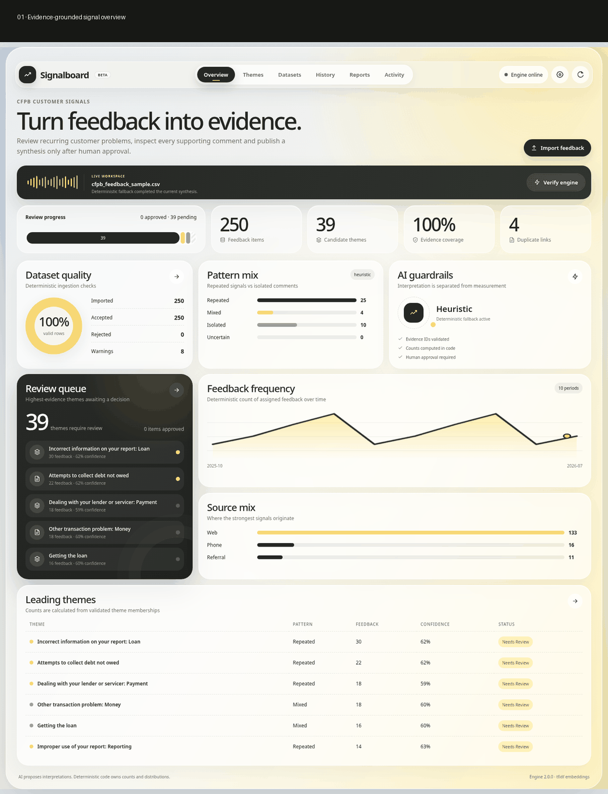
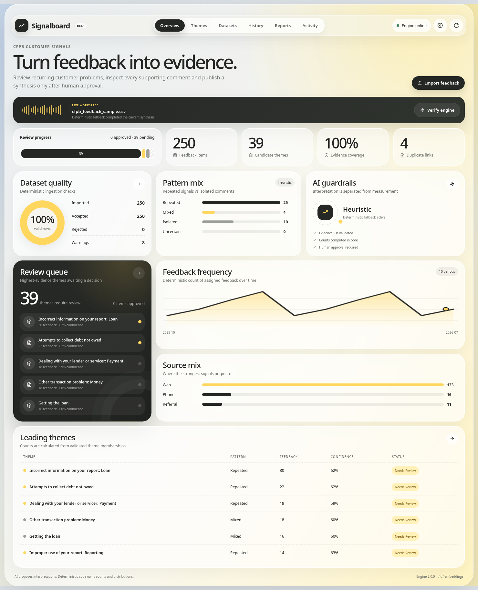
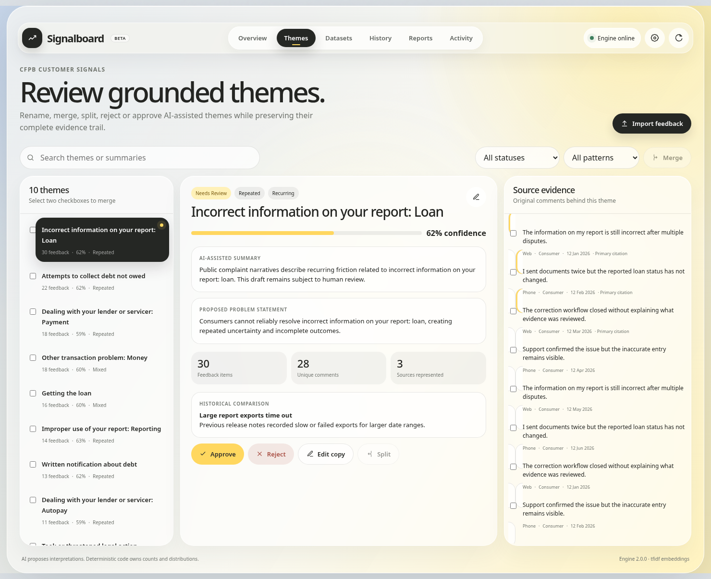
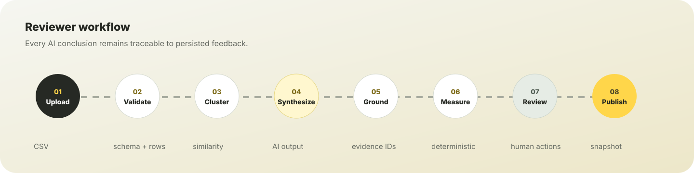
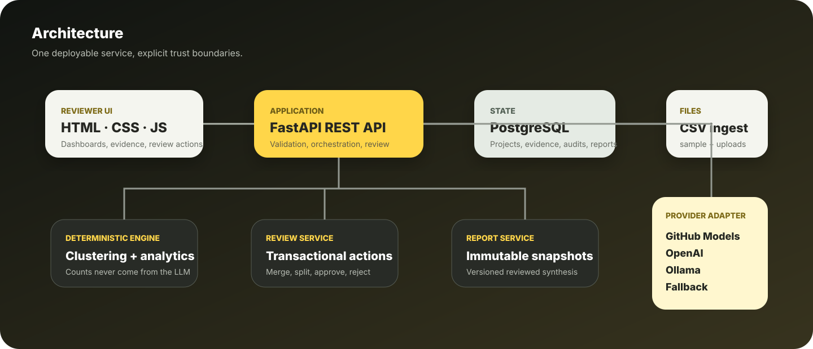

<p align="center">
  
</p>

<p align="center">
  <a href="https://signalboard-feedback-intelligence.onrender.com/"></a>
  <a href="https://signalboard-feedback-intelligence.onrender.com/api/v1/health"></a>
  
  
  
</p>

<h3 align="center">Evidence-grounded AI product-feedback synthesis with deterministic analytics and a complete human-review loop.</h3>

<p align="center">
  <a href="#30-second-product-tour"><strong>Product tour</strong></a> ·
  <a href="#why-it-is-trustworthy"><strong>Trust model</strong></a> ·
  <a href="#reviewer-workflow"><strong>Workflow</strong></a> ·
  <a href="#architecture"><strong>Architecture</strong></a> ·
  <a href="#run-locally"><strong>Run locally</strong></a> ·
  <a href="#deploy-to-render"><strong>Deploy</strong></a>
</p>

---

## The problem it solves

Product feedback arrives through support tickets, surveys, reviews and sales notes. A summary is easy to generate. A synthesis that a product team can **trace, correct and trust** is much harder.

Signalboard turns uploaded feedback into reviewable themes while keeping responsibility explicit:

<table>
<tr>
<td width="33%" valign="top"><h3>AI proposes</h3><p>Candidate themes, summaries, problem statements and historical relationships.</p></td>
<td width="33%" valign="top"><h3>Code proves</h3><p>Counts, distributions, duplicate warnings, frequency over time and evidence coverage.</p></td>
<td width="33%" valign="top"><h3>Humans decide</h3><p>Rename, edit, merge, split, approve, reject and publish the reviewed result.</p></td>
</tr>
</table>

> The model never owns feedback counts and never prioritises the product roadmap.

## 30-second product tour

<p align="center">
  <a href="https://signalboard-feedback-intelligence.onrender.com/">
    
  </a>
</p>

<p align="center"><strong>Click the walkthrough to open the live application.</strong></p>

### Reviewer experience

<table>
<tr>
<td width="50%"></td>
<td width="50%"></td>
</tr>
<tr>
<td align="center"><strong>Signal overview</strong><br><sub>Dataset quality, evidence coverage, recurring patterns and frequency.</sub></td>
<td align="center"><strong>Grounded review</strong><br><sub>Source comments, confidence, history and human approval actions.</sub></td>
</tr>
</table>

## Why it is trustworthy

| Guardrail | What it guarantees |
|---|---|
| Evidence grounding | Every cited feedback ID is checked against persisted cluster membership before storage. |
| Deterministic analytics | Theme counts, source distribution, user-type distribution and frequency are computed in code. |
| Human control | Merge, split, approve, reject and report publication require explicit reviewer action. |
| Product memory isolation | Historical notes inform comparison but never inflate current feedback counts. |
| Immutable reporting | Saved synthesis reports preserve the reviewed state as versioned snapshots. |
| Secret boundaries | Provider credentials stay server-side and never enter browser responses or logs. |

## Reviewer workflow

<p align="center">
  
</p>

### What the product supports

| Stage | Capabilities |
|---|---|
| Ingest | CSV schema validation, header aliases, invalid-row isolation, upload limits and exact-duplicate warnings |
| Prepare | Normalisation, PII-like masking, untrusted-content handling and source preservation |
| Synthesize | Metadata-aware clustering, repeated/mixed/isolated patterns and structured AI output |
| Ground | Evidence-ID validation, source citations and unsupported-output rejection |
| Analyse | Deterministic counts, source/user/product-area mix, ratings and frequency over time |
| Review | Rename, edit, merge, split, approve, reject and inspect full source evidence |
| Remember | Add, edit and delete historical themes or product notes; rerun comparison safely |
| Publish | Save versioned immutable reports containing approved themes, metrics and evidence |

## Real-data validation

The included demonstration uses a mapped **250-record public CFPB complaint sample** rather than a toy five-row dataset.

<table>
<tr><td align="center"><strong>250 / 250</strong><br><sub>accepted rows</sub></td><td align="center"><strong>39</strong><br><sub>candidate themes</sub></td><td align="center"><strong>100%</strong><br><sub>evidence coverage</sub></td><td align="center"><strong>8</strong><br><sub>duplicate warnings</sub></td></tr>
</table>

The release verifier imports the sample into a clean database, runs synthesis, inspects evidence, approves a theme, creates a report and reads the immutable snapshot back.

## Architecture

<p align="center">
  
</p>

The frontend and backend ship as one Docker service. FastAPI serves the reviewer UI and REST API; PostgreSQL stores durable state. The model layer is isolated behind provider adapters for GitHub Models, OpenAI, Ollama and a deterministic credential-free fallback.

**Detailed references:** [`ENGINE_ARCHITECTURE.md`](docs/ENGINE_ARCHITECTURE.md) · [`API_WORKFLOW.md`](docs/API_WORKFLOW.md) · [`OpenAPI`](docs/openapi.json)

## Technology

<p>
  
  
  
  
  
  
  
  
</p>

<details>
<summary><strong>Repository layout</strong></summary>

```text
.
├── src/feedback_intelligence_engine/
│   ├── services/                   # ingestion, clustering, synthesis, review, reports
│   └── web/                        # bundled reviewer interface
├── tests/                          # unit, integration, provider-contract and browser tests
├── scripts/                        # release verification, real-data smoke and media capture
├── data/                           # mapped 250-row public CFPB sample
├── docs/                           # architecture, deployment, screenshots and product tour
├── Dockerfile
├── render.yaml
├── AGENT_USAGE.md
├── .gitignore
└── .env.example                    # names only; no secrets
```

</details>

## Run locally

Python 3.12 or 3.13 is supported.

```bash
python -m venv .venv
source .venv/bin/activate          # Windows: .venv\Scripts\activate
python -m pip install --upgrade pip
pip install -e '.[dev]'
python -m playwright install chromium
cp .env.example .env               # Windows: copy .env.example .env
uvicorn feedback_intelligence_engine.main:app --reload
```

Open:

- Product: `http://localhost:8000/`
- API docs: `http://localhost:8000/docs`
- Health: `http://localhost:8000/api/v1/health`

A credential-free local run uses:

```env
SYNTHESIS_PROVIDER=heuristic
EMBEDDING_PROVIDER=tfidf
```

<details>
<summary><strong>CSV contract</strong></summary>

```text
feedback_text
source
user_type
product_area
date
rating          # optional
```

Aliases such as `comment`, `channel`, `segment`, `module`, `submitted_at` and `stars` are detected automatically.

</details>

<details>
<summary><strong>Hosted or local AI configuration</strong></summary>

Recommended zero-cost hosted route:

```env
GITHUB_TOKEN=
GITHUB_MODEL=openai/gpt-4.1-mini
SYNTHESIS_PROVIDER=auto
EMBEDDING_PROVIDER=tfidf
```

The token remains in the backend environment. A real `.env` is excluded by `.gitignore`; `.env.example` contains blank names only.

Alternative providers and local Ollama setup: [`FREE_AI_SETUP.md`](docs/FREE_AI_SETUP.md)

</details>

## Verification

```bash
PYTHONPATH=src pytest --cov=feedback_intelligence_engine --cov-report=term-missing --cov-fail-under=80
PYTHONPATH=src python scripts/verify_release.py
python scripts/capture_product_media.py
```

Release v2.0.0 baseline:

```text
20 tests passed
83%+ statement coverage
250/250 real sample rows accepted
39 reviewable candidate themes
100% evidence coverage
```

Browser QA covers modal X/Done/Cancel, backdrop close, `Escape`, focus behaviour, provider verification, historical-memory CRUD, rename, approve, merge, split and report creation. Full record: [`VERIFICATION.md`](docs/VERIFICATION.md)

## Deploy to Render

The root `render.yaml` provisions one Docker web service, one PostgreSQL database, `/api/v1/health` monitoring and commit-triggered deployment.

1. Upload repository-root files to GitHub.
2. In Render choose **New → Blueprint** and connect the repository.
3. Provide `GITHUB_TOKEN` as a secret when prompted.
4. Confirm both resources use the free plan.
5. Deploy and verify `/api/v1/health`.
6. Open **Provider settings → Run live provider check**.

Detailed guide: [`DEPLOY_RENDER.md`](docs/DEPLOY_RENDER.md)

> Render's free web service can sleep after inactivity. The first request after sleep may take roughly a minute.

<details>
<summary><strong>Known limitations</strong></summary>

- Analysis currently runs synchronously; a queue-backed worker is the next step for larger datasets.
- TF-IDF is tuned for English. Multilingual production use should select multilingual embeddings.
- The assessment build uses a demo `X-User-Id` boundary; production multi-tenancy requires verified sessions or JWTs.
- Free hosted model usage is rate-limited and model availability can change.
- Render free services can cold-start after inactivity.

</details>

## Responsible agent use

Coding assistance, representative prompts, rejected suggestions, discovered mistakes and verification steps are documented in [`AGENT_USAGE.md`](AGENT_USAGE.md).

---

<p align="center"><strong>Signalboard turns model output into a reviewable product decision artefact—not an untraceable summary.</strong></p>
